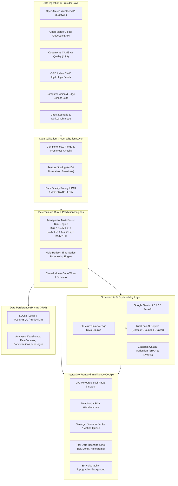

# RISKLENS AI — Predict. Understand. Decide.

> **Hackathon Track**: Track 01 — AI, ML & Emerging Technologies  
> **Primary Problem Statement**: **PS 05 — AI for Prediction & Decision Support**  
> **Core Concept**: Enterprise Decision-Intelligence & Predictive Risk Engine turning live verified telemetry, qualitative narratives, and computer vision scans into transparent, explainable predictions and prioritized action plans.

---

## 🚀 Executive Summary

Modern enterprise operations—from regional power grids and semiconductor cleanrooms to coastal hydrological watersheds—generate immense volumes of telemetry and qualitative incident reports. However, traditional monitoring dashboards merely trigger alarms without quantifying systemic vulnerability, explaining root causes, or formulating prioritized mitigation strategies.

**RiskLens AI** is an intelligent decision-support platform built for **PS 05 (AI for Prediction & Decision Support)**. Rather than acting as a generic conversational chatbot, RiskLens AI provides an **intelligent decision cockpit** with a complete 8-stage traceable workflow:

```
REAL DATA  ──►  DATA PROVIDER  ──►  VALIDATION  ──►  NORMALIZATION  ──►  RISK ENGINE  ──►  PREDICTION  ──►  XAI & COPILOT  ──►  DECISIONS
(Open-Meteo /      (ECMWF &          (Completeness      (Standardized        (Deterministic      (Multi-Horizon       (Grounded RAG &        (Prioritized
 Copernicus)        Geospatial)       & Freshness)       0-100 Scales)       Weighted Scoring)    Forecast Curves)     Zero Fabrication)      Action Plans)
```

---

## 🏛️ System Architecture



---

## 🌟 Key Features

### 1. Real-Data Driven & Traceable Architecture
- **Verified Public Data Feeds**: Live connection to Open-Meteo High-Resolution Weather, ECMWF 7-day forecast models, and Copernicus Atmosphere Monitoring Service (CAMS).
- **Data Provenance & Citation Drawer**: Every live evaluation displays exact API endpoints, update timestamps, data freshness (< 15 min), licenses (ODbL / CC BY 4.0), and data quality ratings.
- **Zero Fabrication**: If an API is unavailable or unconfigured, the system explicitly displays `Live data unavailable` or switches to `Demo Mode` with deterministic seeded scenarios.

### 2. Transparent Risk Calculation Engine
- **Mathematical Formula**:
  $$\text{Composite Risk} = (0.35 \times F_1) + (0.25 \times F_2) + (0.20 \times F_3) + (0.20 \times F_4)$$
  - **$F_1$ (35%)**: Current & 24h Precipitation Intensity ($mm$)
  - **$F_2$ (25%)**: 72-Hour Cumulative Forecast Trend ($mm$)
  - **$F_3$ (20%)**: Atmospheric Saturation & Pressure Anomaly ($RH\%$, $hPa$)
  - **$F_4$ (20%)**: Elevation & Topographical Hydrological Vulnerability ($m\text{ ASL}$)
- **Configurable Risk Threshold Bands**:
  - `0 – 24`: **LOW**
  - `25 – 49`: **MODERATE**
  - `50 – 74`: **HIGH**
  - `75 – 100`: **CRITICAL**

### 3. Grounded AI Copilot ("RiskLens AI Copilot")
- **Specialized AI Assistant**: Accessed via a floating action trigger at bottom-right opening a slide-over drawer (`380–420px`).
- **Strictly Grounded RAG**: Answers queries by retrieving from (1) active database analysis context, (2) live Open-Meteo telemetry, (3) What-If Monte Carlo calculations, and (4) structured `/knowledge/` markdown files.
- **Dynamic Suggested Actions & Citations**: One-click follow-up queries and expandable data source badges with match confidence.

### 4. Interactive "What-If" Scenario Simulator
- Live parameter sliders allow operators to perturb variables (e.g. *Rainfall +30%*, *Temperature +4°C*).
- Instantly recalculates real-time risk deltas (e.g. `22.5 → 54.2 (+31.7)`), updates future forecast curves, and isolates the primary driver.

### 5. Strategic Decision Center & Human-in-the-Loop Triage
- Prioritized mitigation recommendations (**Priority 1 Immediate**, **Priority 2 48h**, **Priority 3 Routine**).
- Quantified risk reduction estimates (e.g. `-24.5% Risk Reduction`) with 1-click **Accept**, **Save**, and **Dismiss** actions with automated audit logging.

### 6. Photorealistic 3D Holographic Background
- Interactive 3D holographic digital terrain mesh with smooth mouse parallax tracking.
- Floating 3D spatial risk nodes and subtle radar scan pulses.
- Calibrated dark glass vignette overlay ensuring 100% crisp typography and chart contrast.

---

## 📦 API Endpoint Reference

| Method | Endpoint | Description |
| :--- | :--- | :--- |
| `GET` | `/api/health` | System health check and PS 05 metadata |
| `GET` | `/api/data/status` | Real-time status of all external data providers and AI engine |
| `GET` | `/api/data/sources` | List registered data sources, endpoints, licenses, and latencies |
| `GET` | `/api/weather` | Current weather observations for latitude/longitude or city |
| `GET` | `/api/weather/history` | Past 24h hourly meteorological telemetry |
| `GET` | `/api/weather/forecast` | 72h / 7-day forecast series |
| `GET` | `/api/air-quality` | Copernicus CAMS air quality metrics (AQI, PM2.5, PM10, NO2, O3) |
| `POST` | `/api/geocode` | Geocode city/address into coordinates and elevation |
| `POST` | `/api/analyze` | Run structured multi-factor risk and prediction analysis |
| `POST` | `/api/analyze/text` | Natural language narrative semantic risk extraction |
| `POST` | `/api/analyze/image` | Computer vision defect and aerial flood scan |
| `POST` | `/api/data/analyze/live` | Perform end-to-end live analysis from real Open-Meteo feeds |
| `POST` | `/api/simulate` | Causal What-If Monte Carlo parameter simulation |
| `GET` | `/api/analyses` | List historical analyses with category/severity filters |
| `GET` | `/api/analyses/:id` | Get full detailed analysis dossier |
| `DELETE` | `/api/analyses/:id` | Delete analysis record |
| `GET` | `/api/scenarios` | List 5 curated live demo scenarios |
| `POST` | `/api/scenarios/:id/run` | Execute complete autonomous pipeline for a scenario |
| `POST` | `/api/chat` | Grounded AI Copilot query endpoint |
| `GET` | `/api/decisions` | Fetch prioritized decision actions queue (Priority 1, 2, 3) |
| `PATCH` | `/api/decisions/:id/status` | Update decision status (ACCEPTED, DISMISSED, SAVED) |
| `POST` | `/api/recommendations/:id/accept` | 1-Click accept recommendation action |
| `POST` | `/api/recommendations/:id/save` | 1-Click save recommendation action |
| `POST` | `/api/recommendations/:id/dismiss` | 1-Click dismiss recommendation action |
| `GET` | `/api/insights` | Real-time AI anomaly and trend stream |
| `POST` | `/api/reports` | Generate audit-ready executive intelligence report |

---

## 💻 Quickstart & Local Setup

### 1. Prerequisites
- Node.js `v18+` or `v20+` (tested on Node v24)
- npm `v9+` or `v11+`

### 2. Installation
```bash
git clone https://github.com/your-org/risklens-ai.git
cd risklens-ai

# Install root, server, and client dependencies
npm run install:all
```

### 3. Environment Variables
Copy `.env.example` to `.env`:
```bash
cp .env.example .env
```
*(Optional: Add `GEMINI_API_KEY="your_api_key"` to enable online Gemini 2.5/2.0 Pro. If omitted, RiskLens AI operates seamlessly in built-in Deterministic Reasoning Mode).*

### 4. Database Setup & Seeding
```bash
# Push schema and seed 20+ historical analyses and 5 preset scenarios
npm run seed
```

### 5. Launch Full Stack
```bash
npm run dev
```
- **Frontend Cockpit**: `http://localhost:5173`
- **Backend API**: `http://localhost:5000`

---

## 🛡️ Responsible AI, Truthfulness & Limitations

- **Zero-Fabrication Guarantee**: Numerical metrics, timestamps, and data sources are never hallucinated by generative models.
- **Estimated Risk Framing**: Predictions are explicitly framed as *"Estimated Risk"* and *"Forecast Projection based on available telemetry"*.
- **Operational Boundaries**:
  - Live meteorological telemetry uses a 15-minute update cadence.
  - Hyper-localized microbursts (< 1 km scale) may exceed global model resolution.
  - RiskLens AI provides decision-support intelligence and does not perform autonomous hazardous actuation.

---

## 📄 License
MIT License. Created for Hackathon Track 01 (AI, ML & Emerging Technologies), Problem Statement 05 (AI for Prediction & Decision Support).
